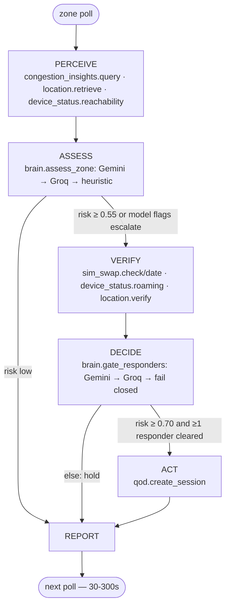

# SAKINA

**Situational Awareness for Kinetic crowd Intelligence & Network Adaptation**

An AI agent that reads telecom network signals to detect crowd-crush risk at mass
gatherings, and elevates emergency responder bandwidth — but only for responders
whose identity the network can vouch for.

GSMA MENA Ignite Hackathon · Theme 3: Tourism, Pilgrimage & Cultural Experience
Innovation · Built on Nokia Network-as-Code (CAMARA).

---

## The problem

Hajj concentrates roughly two million people into a few square kilometres. The
2015 Mina crush killed over 2,000 of them. Crowd density is invisible until it is
lethal — and when density spikes, the cellular network degrades at exactly the
moment responders need it most. Congestion is both the symptom and the obstacle.

There is no dense sensor grid over Mina. But every pilgrim carries a handset, and
the network already knows something about all of them.

## The insight

**Network congestion is a proxy for crowd density — a noisy, unreliable one.**

CAMARA's Congestion Insights returns a `confidenceLevel` alongside every reading.
That field is the whole project. It means a reading is *evidence of varying
weight*, not a fact. Consider a real window from the Nokia simulator:

```
13:33  High   confidence  71%
13:38  Medium confidence  16%   <- near-worthless
13:43  High   confidence  51%
13:48  Low    confidence  97%
```

A threshold engine sees `Low` and stands down. But is that dispersal, or did the
telemetry just improve while the crowd stayed? Answering *that* requires weighing
a confidence trend against corroborating signals that may disagree. It is not
expressible as an `if` statement — which is why this needs an agent.

SAKINA reasons about **uncertainty over time**:

- confidence-weighted mean: **1.11** vs naive mean **1.25** — the 16% reading is
  correctly discounted
- volatility **1.33/2.0** — the cell is not settled
- confidence trend **improving** (71 → 97) — supports genuine dispersal
- but **100% of devices are on SMS-only fallback** — an independent signal that
  the data plane is still saturated, *contradicting* the Low reading

The agent surfaces that contradiction rather than resolving it away.

## The security layer

Whoever can trigger a QoD elevation controls emergency bandwidth allocation at a
mass gathering. That is worth attacking.

So before elevating any responder, SAKINA checks the network's own view of that
handset: SIM Swap, roaming status, and Location Verification. A responder whose
SIM changed hours before the event, roaming on a foreign network, whose position
the network cannot confirm, is a plausible impersonation — and is refused.

Refusing a real medic also costs lives, so this is a judgement call, not a rule.
Roaming alone means nothing (Hajj is the largest roaming event on earth). Three
coherent signals mean something.

## CAMARA APIs orchestrated

| API | Role |
|---|---|
| **Congestion Insights** | Primary density proxy; confidence-weighted trend |
| **Location Retrieval** | Grounds congestion in geography; fix-quality signal |
| **Location Verification** | Is this responder actually where they claim? |
| **Device Status** | SMS-only fallback corroborates density; roaming for identity |
| **SIM Swap** | Identity gate — recent swap blocks elevation |
| **Quality on Demand** | The action: elevate verified responders only |
| **Geofencing** | Zone-entry event model |

Seven APIs. Each earns its place; none is decorative.

## Agent architecture

```
PERCEIVE ──► ASSESS ──┬──► (risk low) ─────────────► REPORT
                      │
                      └──► VERIFY ──► DECIDE ──┬──► ACT ──► REPORT
                                               └──► REPORT
```

Built with **LangGraph** (`StateGraph`). The conditional edges are the point — the
agent decides:

- whether evidence warrants spending identity checks (5 extra API calls)
- which responders to verify
- whether to spend a QoD session on each

Nothing is user-triggered. The operator watches; the agent acts.



Every CAMARA call's provenance is decided in exactly one place —
`camara.py::CamaraTools._invoke` — never scattered across call sites:

```mermaid
flowchart LR
    A["any CAMARA call"] --> B{"replay mode or\nno live client?"}
    B -->|yes| F["load_fixture&#40;&#41;"]
    B -->|no| C["attempt live call"]
    C --> D{"succeeded?"}
    D -->|yes| E["Source.LIVE"]
    D -->|no| G{"mode?"}
    G -->|hybrid| H["trace.degrade&#40;&#41;"]
    H --> F
    G -->|live| I["raise — fail loudly"]
    F --> J["Source.CACHE"]
```



Cached data is never disguised as live — `Source.LIVE` / `Source.CACHE` is
carried on every trace entry, and `live` mode never silently masks an outage.

## Stack

All components from the hackathon's AI Resource & Tooling Guide:

| Layer | Choice | Guide § |
|---|---|---|
| Orchestration | LangGraph | §2 code-first frameworks |
| Reasoning | Gemini 2.5 Flash | §3 hosted APIs, free tier |
| Fallback | Groq Llama 3.3 70B | §3 — for rate limits |
| UI | Streamlit | §6 hosting & deployment |
| Data | Nokia Network-as-Code | §5 CAMARA trusted data layer |

## Reliability

The Guide asks for graceful degradation and cached demo data. Both are load-bearing
here, not decoration:

- **Model fallback** — Gemini rate-limits → Groq; both unreachable → deterministic
  heuristic, clearly labelled as inferior in the trace
- **API fallback** — `hybrid` mode serves a recorded response when a live call
  fails, and *says so in the trace*. Cached data is never disguised as live.
- **Fail closed** — no model means no elevation. Refusing a medic is recoverable;
  handing an impersonator priority spectrum is not.

## Running it

```bash
pip install -r requirements.txt
cp .env.example .env      # add your keys
streamlit run app.py
```

Works with **no keys at all** in `replay` mode, against responses recorded from
the Nokia portal.

```bash
python run_cycle.py jamarat-bridge   # headless, prints the reasoning trace
python -m pytest tests/ -v           # 21 tests on the confidence-weighting core
```

### Credentials

`NAC_API_KEY` is a **RapidAPI** key, not a Nokia portal key — the SDK's default
environment is `network-as-code.p-eu.rapidapi.com`. Get a free Gemini key at
[aistudio.google.com/apikey](https://aistudio.google.com/apikey).

## Layout

```
sakina/
  config.py    zones, device roster, thresholds
  trace.py     reasoning trace — the artifact judges watch
  camara.py    CAMARA tool layer; live/cache/degrade decided in one place
  signals.py   confidence-weighted interpretation (deterministic, tested)
  brain.py     LLM reasoning + prompts + provider fallback
  agent.py     LangGraph StateGraph
app.py         Streamlit operator console
tests/         21 tests against real playground payloads
fixtures/      recorded Nokia NaC responses
```

`signals.py` does arithmetic; `brain.py` does judgement. The split is deliberate:
a system where a threshold function decides and the LLM writes the press release
is not an agent.

## Status

Verified against the Nokia NaC portal playground on 2026-07-15: all seven APIs
respond. QoS profile `DOWNLINK_M_UPLINK_L`. Simulator numbers `+99999991000`
(SIM-swapped, roaming HU) and `+99999991001` (clean, QoD-capable).

## Licence

MIT
