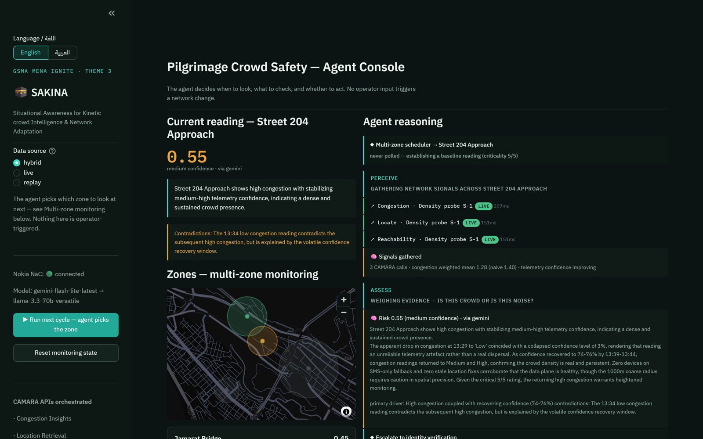
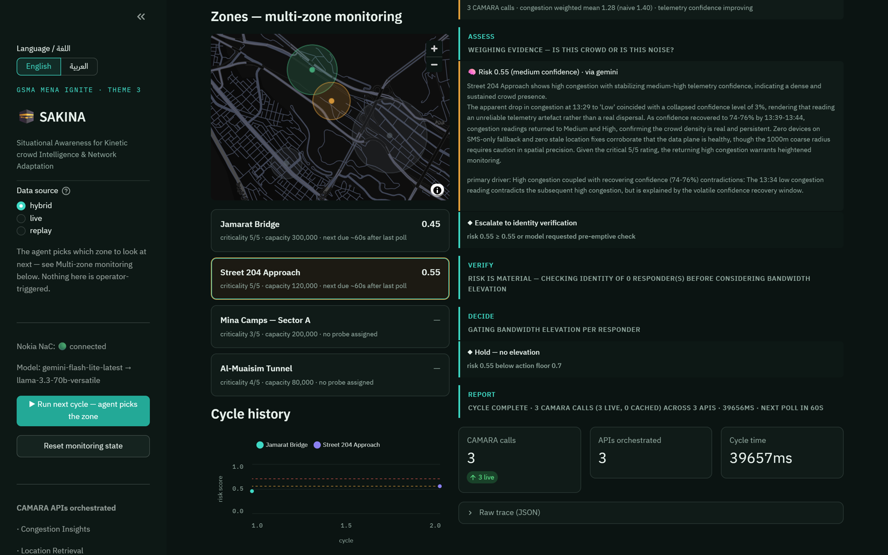
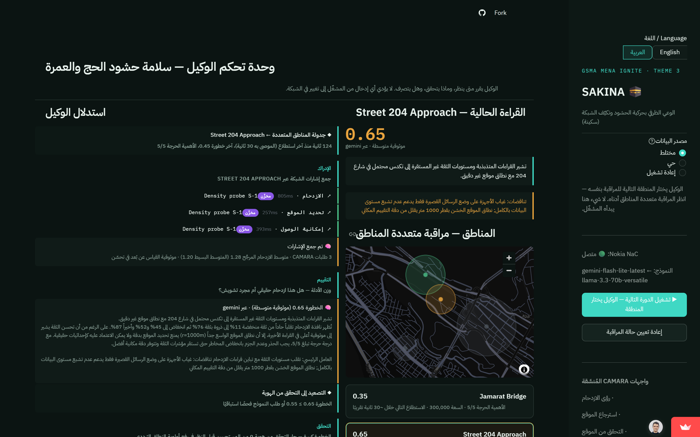
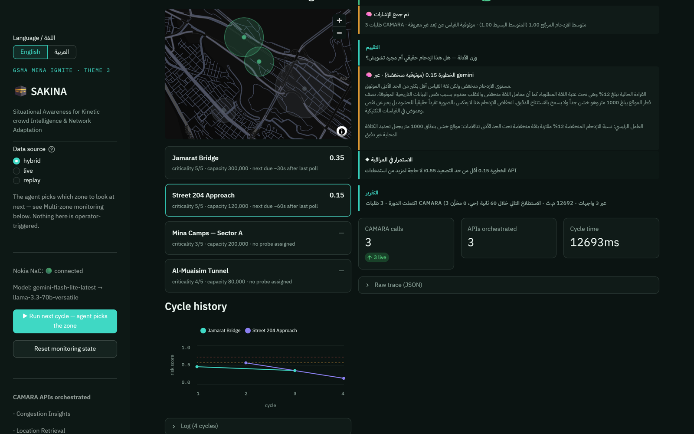

# SAKINA

**English** · [العربية](README_AR.md)

**Situational Awareness for Kinetic crowd Intelligence & Network Adaptation**

An AI agent that reads telecom network signals to detect crowd-crush risk at mass
gatherings, and elevates emergency responder bandwidth — but only for responders
whose identity the network can vouch for.

GSMA MENA Ignite Hackathon · Theme 3: Tourism, Pilgrimage & Cultural Experience
Innovation · Built on Nokia Network-as-Code (CAMARA).

**Live demo:** https://sakina.streamlit.app · **Repo:** https://github.com/MhmoodHmmam/sakina



<details><summary>More screenshots — identity gate, Arabic RTL console, cycle history</summary>





</details>

---

## The problem

Hajj concentrates roughly two million people into a few square kilometres. The
2015 Mina crush killed over 2,000 of them. Crowd density is invisible until it is
lethal — and when density spikes, the cellular network degrades at exactly the
moment responders need it most. Congestion is both the symptom and the obstacle.

There is no dense sensor grid over Mina. But every pilgrim carries a handset, and
the network already knows something about all of them.

## The insight

**Network congestion is a proxy for crowd density — a noisy, unreliable one.**

CAMARA's Congestion Insights returns a `confidenceLevel` alongside every reading.
That field is the whole project. It means a reading is *evidence of varying
weight*, not a fact. Consider a real window from the Nokia simulator:

```
13:33  High   confidence  71%
13:38  Medium confidence  16%   <- near-worthless
13:43  High   confidence  51%
13:48  Low    confidence  97%
```

A threshold engine sees `Low` and stands down. But is that dispersal, or did the
telemetry just improve while the crowd stayed? Answering *that* requires weighing
a confidence trend against corroborating signals that may disagree. It is not
expressible as an `if` statement — which is why this needs an agent.

SAKINA reasons about **uncertainty over time**:

- confidence-weighted mean: **1.11** vs naive mean **1.25** — the 16% reading is
  correctly discounted
- volatility **1.33/2.0** — the cell is not settled
- confidence trend **improving** (71 → 97) — supports genuine dispersal
- but **100% of devices are on SMS-only fallback** — an independent signal that
  the data plane is still saturated, *contradicting* the Low reading

The agent surfaces that contradiction rather than resolving it away.

## The security layer

Whoever can trigger a QoD elevation controls emergency bandwidth allocation at a
mass gathering. That is worth attacking.

So before elevating any responder, SAKINA checks the network's own view of that
handset: SIM Swap, roaming status, and Location Verification. A responder whose
SIM changed hours before the event, roaming on a foreign network, whose position
the network cannot confirm, is a plausible impersonation — and is refused.

Refusing a real medic also costs lives, so this is a judgement call, not a rule.
Roaming alone means nothing (Hajj is the largest roaming event on earth). Three
coherent signals mean something.

## CAMARA APIs orchestrated

| API | Role |
|---|---|
| **Congestion Insights** | Primary density proxy; confidence-weighted trend |
| **Location Retrieval** | Grounds congestion in geography; fix-quality signal |
| **Location Verification** | Is this responder actually where they claim? |
| **Device Status** | SMS-only fallback corroborates density; roaming for identity |
| **SIM Swap** | Identity gate — recent swap blocks elevation |
| **Quality on Demand** | The action: elevate verified responders only |
| **Geofencing** | Zone-entry event model |

Seven APIs. Each earns its place; none is decorative.

## Agent architecture

```
PERCEIVE ──► ASSESS ──┬──► (risk low) ─────────────► REPORT
                      │
                      └──► VERIFY ──► DECIDE ──┬──► ACT ──► REPORT
                                               └──► REPORT
```

Built with **LangGraph** (`StateGraph`). The conditional edges are the point — the
agent decides:

- whether evidence warrants spending identity checks (5 extra API calls)
- which responders to verify
- whether to spend a QoD session on each

Nothing is user-triggered. The operator watches; the agent acts.

### Multi-zone scheduling

The operator doesn't pick which zone to look at either. `scheduler.py` runs
deterministic priority arithmetic — never-polled zones first (criticality
breaks ties), then how overdue a zone is scaled by its last risk and
criticality — and the choice is logged as a trace decision before the cycle
even starts. Same split as `signals.py`/`brain.py`: this is arithmetic, not
judgement; the model still only ever reasons about one zone at a time.


Every CAMARA call's provenance is decided in exactly one place —
`camara.py::CamaraTools._invoke` — never scattered across call sites:

```mermaid
flowchart LR
    A["any CAMARA call"] --> B{"replay mode or\nno live client?"}
    B -->|yes| F["load_fixture&#40;&#41;"]
    B -->|no| C["attempt live call"]
    C --> D{"succeeded?"}
    D -->|yes| E["Source.LIVE"]
    D -->|no| G{"mode?"}
    G -->|hybrid| H["trace.degrade&#40;&#41;"]
    H --> F
    G -->|live| I["raise — fail loudly"]
    F --> J["Source.CACHE"]
```



Cached data is never disguised as live — `Source.LIVE` / `Source.CACHE` is
carried on every trace entry, and `live` mode never silently masks an outage.

## Stack

All components from the hackathon's AI Resource & Tooling Guide:

| Layer | Choice | Guide § |
|---|---|---|
| Orchestration | LangGraph | §2 code-first frameworks |
| Reasoning | Gemini (`gemini-flash-lite-latest`) | §3 hosted APIs, free tier |
| Fallback | Groq Llama 3.3 70B | §3 — for rate limits |
| UI | Streamlit | §6 hosting & deployment |
| Data | Nokia Network-as-Code | §5 CAMARA trusted data layer |

## Bilingual — English / Arabic

Built for the MENA region: the console's language toggle switches both the
static UI and the agent's own reasoning — `brain.py` asks Gemini/Groq to
answer in Arabic when selected, it isn't a translation layer bolted onto
English output. RTL is a full layout mirror via CSS logical properties
(`border-inline-start`, `text-align: start`), not just right-aligned text.
`i18n.py` handles everything SAKINA itself generates (trace labels, UI
chrome); every string is tested for EN/AR placeholder parity. Known
limitation: the map and native Streamlit charts/tables keep their internal
left-to-right rendering — flagged in the UI itself when Arabic is selected.

## Reliability

The Guide asks for graceful degradation and cached demo data. Both are load-bearing
here, not decoration:

- **Model fallback** — Gemini rate-limits → Groq; both unreachable → deterministic
  heuristic, clearly labelled as inferior in the trace
- **API fallback** — `hybrid` mode serves a recorded response when a live call
  fails, and *says so in the trace*. Cached data is never disguised as live.
- **Fail closed** — no model means no elevation. Refusing a medic is recoverable;
  handing an impersonator priority spectrum is not.

## Running it

```bash
pip install -r requirements.txt
cp .env.example .env      # add your keys
streamlit run app.py
```

Works with **no keys at all** in `replay` mode, against responses recorded from
the Nokia portal.

```bash
python run_cycle.py jamarat-bridge   # headless, prints the reasoning trace
python -m pytest tests/ -v           # 53 tests
```

### Credentials

`NAC_API_KEY` is a **RapidAPI** key, not a Nokia portal key — the SDK's default
environment is `network-as-code.p-eu.rapidapi.com`. Get a free Gemini key at
[aistudio.google.com/apikey](https://aistudio.google.com/apikey).

## Layout

```
sakina/
  config.py     zones, device roster, thresholds
  trace.py      reasoning trace — the artifact judges watch
  camara.py     CAMARA tool layer; live/cache/degrade decided in one place
  signals.py    confidence-weighted interpretation (deterministic, tested)
  scheduler.py  multi-zone priority arithmetic — which zone next (deterministic, tested)
  i18n.py       EN/AR string lookup for everything SAKINA itself generates
  brain.py      LLM reasoning + prompts + provider fallback + Arabic directive
  agent.py      LangGraph StateGraph
app.py          Streamlit operator console (bilingual, RTL)
tests/          53 tests against real playground payloads and live-confirmed bugs
fixtures/       recorded Nokia NaC responses
```

`signals.py` does arithmetic; `brain.py` does judgement. The split is deliberate:
a system where a threshold function decides and the LLM writes the press release
is not an agent.

## Status

Verified against the Nokia NaC portal playground on 2026-07-15: all seven APIs
respond. QoS profile `DOWNLINK_M_UPLINK_L`. Simulator numbers `+99999991000`
(SIM-swapped, roaming HU) and `+99999991001` (clean, QoD-capable).

## Related work — and what's different

SAKINA sits on ground others have already mapped. Naming it is fairer to them and clearer for a reviewer.

- **The network as a crowd sensor.** Orange's research on network signalling data detects stampede-class urban events at minute resolution ([Lemaire et al., PLOS ONE 2024](https://journals.plos.org/plosone/article?id=10.1371/journal.pone.0309093)) but is explicitly *not intended to be autonomous*; Orange's Flux Vision with the [CAMARA Population Density API](https://developer.orange.com/blog/camara-population-density-data-api-and-flux-vision/) monitored 100 entry points at the Paris 2024 Games. *SAKINA closes the loop — sense, judge, act — with no operator trigger.*
- **An agent that raises QoD when congestion rises.** Nokia's [MWC26 demo with Summit Tech](https://www.summit-tech.ca/en/mwc26-nokia) has AI agents watch congestion over MCP and trigger Quality on Demand to keep an 8K stream flawless. *SAKINA treats each congestion reading as evidence of stated weight, reasons about whether falling congestion is dispersal or blindness, and decides for itself when that uncertainty is worth five more API calls.*
- **A network check gating an agent's action.** Orange's [banking assistant](https://developer.orange.com/blog/from-blind-bots-to-network-aware-agents-securing-mobile-banking-with-mcp-and-orange-sim-swap-api/) refuses contactless payment if the SIM changed within 48 hours (July 2026). *SAKINA applies the pattern to spectrum: SIM swap, roaming and location verification gate a QoD elevation, and it fails closed.*
- **Hajj crowd management.** Camera-based density estimation dominates — e.g. KFUPM's [US 12,417,639](https://patents.google.com/patent/US12417639) (CCTV density + SMS to pilgrims) and the CCTV deep-learning literature. *SAKINA needs no new sensors; every pilgrim already carries one.*
- **QoD for first responders** is an established CAMARA use case ([Orange](https://developer.orange.com/apis/camara-quality-of-service-on-demand), [Flock Safety](https://www.flocksafety.com/blog/flock-safety-calls-on-mobile-network-operators-to-help-accelerate-drone-public-safety-operations)). *Not claimed as new. What is new is who gets it, and why.*

What that buys a control room: earlier warning without new hardware; no false comfort from a confident-looking *Low*; and priority bandwidth an impersonator cannot obtain.

## Licence

MIT

## License

MIT — see [LICENSE](LICENSE).
