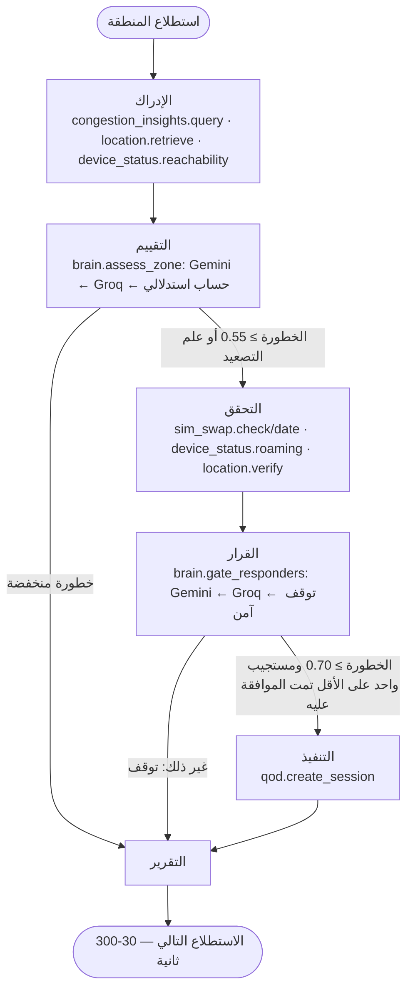

# سكينة (SAKINA)

[English](README.md) · **العربية**

**الوعي الظرفي بحركية الحشود وتكيّف الشبكة**
*(Situational Awareness for Kinetic crowd Intelligence & Network Adaptation)*

وكيل ذكاء اصطناعي يقرأ إشارات شبكة الاتصالات لرصد مخاطر تدافع الحشود في
التجمعات الجماهيرية، ويرفع أولوية اتصال المستجيبين للطوارئ — لكن فقط لمن
تستطيع الشبكة نفسها تأكيد هويته.

هاكاثون GSMA MENA Ignite · الموضوع 3: السياحة والحج والابتكار الثقافي ·
مبني على Nokia Network-as-Code (CAMARA).

**العرض الحي:** https://sakina.streamlit.app · **المستودع:** https://github.com/MhmoodHmmam/sakina

---

## المشكلة

يجمع الحج نحو مليوني شخص في مساحة لا تتجاوز بضعة كيلومترات مربعة. تدافع منى
عام 2015 أودى بحياة أكثر من 2,000 شخص. كثافة الحشود غير مرئية حتى تصبح مميتة
— وعندما ترتفع الكثافة، تتدهور شبكة الجوّال في اللحظة التي يحتاج فيها
المستجيبون إليها أكثر من أي وقت. الازدحام هو في آن واحد العرَض والعائق.

لا توجد شبكة استشعار كثيفة فوق منى. لكن كل حاج يحمل بالفعل هاتفًا، والشبكة
تعرف بالفعل شيئًا عن جميعهم.

## الفكرة الجوهرية

**ازدحام الشبكة مقياس بديل لكثافة الحشود — بديل مشوَّش وغير موثوق تمامًا.**

تُرجع واجهة Congestion Insights من CAMARA حقل `confidenceLevel` مع كل قراءة.
هذا الحقل هو جوهر المشروع بأكمله. فهو يعني أن القراءة *دليل متفاوت الوزن*،
لا حقيقة مطلقة. تأمل هذه النافذة الحقيقية من محاكي Nokia:

```
13:33  High   confidence  71%
13:38  Medium confidence  16%   <- شبه عديمة القيمة
13:43  High   confidence  51%
13:48  Low    confidence  97%
```

محرك العتبات يرى `Low` ويتوقف عن التنبه. لكن هل هذا تفرّق فعلي، أم أن القياس
عن بُعد تحسّن فقط بينما بقي الحشد؟ الإجابة تتطلب موازنة اتجاه الثقة مقابل
إشارات مساندة قد تتعارض — ولا يمكن التعبير عنها بجملة شرطية، ولهذا يحتاج
الأمر إلى وكيل ذكي.

تستدل سكينة على **عدم اليقين عبر الزمن**:

- المتوسط المرجَّح بالثقة: **1.11** مقابل المتوسط البسيط **1.25** — يتم خصم
  قراءة الـ16% بشكل صحيح
- التقلب **1.33/2.0** — الخلية غير مستقرة
- اتجاه الثقة **في تحسّن** (71 ← 97) — يدعم التفرّق الحقيقي
- لكن **100% من الأجهزة على وضع الرسائل القصيرة فقط** — إشارة مستقلة على أن
  مستوى البيانات ما زال مشبعًا، *تناقض* قراءة "منخفض"

الوكيل يُظهر هذا التناقض بدلاً من حلّه بعيدًا.

## طبقة الأمان

من يستطيع تفعيل رفع QoD يتحكم في تخصيص النطاق الترددي للطوارئ في تجمع
جماهيري. وهذا يستحق الاستهداف.

لذا، قبل رفع أي مستجيب، تتحقق سكينة من رؤية الشبكة نفسها لذلك الجهاز: تبديل
شريحة SIM، حالة التجوال، والتحقق من الموقع. مستجيب تغيّرت شريحته قبل ساعات من
الحدث، متجوّل على شبكة أجنبية، لا تستطيع الشبكة تأكيد موقعه — هو انتحال محتمل،
ويُرفض.

رفض طبيب حقيقي يكلّف أرواحًا أيضًا، فهذا حكم، لا قاعدة. التجوال وحده لا يعني
شيئًا (الحج أكبر حدث تجوال على وجه الأرض). ثلاث إشارات متجانسة تعني شيئًا.

## واجهات CAMARA المُنسَّقة

| الواجهة | الدور |
|---|---|
| **رؤى الازدحام** | المقياس البديل الأساسي للكثافة؛ اتجاه مرجَّح بالثقة |
| **استرجاع الموقع** | يؤسس الازدحام جغرافيًا؛ إشارة جودة التموضع |
| **التحقق من الموقع** | هل هذا المستجيب فعلاً حيث يدّعي؟ |
| **حالة الجهاز** | وضع الرسائل القصيرة فقط يدعم الكثافة؛ التجوال للهوية |
| **تبديل شريحة SIM** | بوابة الهوية — تبديل حديث يمنع الرفع |
| **جودة الخدمة عند الطلب** | الإجراء: رفع أولوية المستجيبين المتحقق منهم فقط |
| **السياج الجغرافي** | نموذج أحداث دخول المنطقة |

سبع واجهات. كل واحدة تستحق مكانها؛ لا شيء زخرفي.

## معمارية الوكيل

```
PERCEIVE ──► ASSESS ──┬──► (risk low) ─────────────► REPORT
                      │
                      └──► VERIFY ──► DECIDE ──┬──► ACT ──► REPORT
                                               └──► REPORT
```

مبنية بـ **LangGraph** (`StateGraph`). الحواف الشرطية هي جوهر التصميم —
الوكيل يقرر:

- هل تستدعي الأدلة إنفاق فحوصات الهوية (5 مكالمات إضافية)
- أي المستجيبين يتم التحقق منه
- هل يستحق الأمر جلسة QoD لكل منهم

لا شيء هنا يبدأه المستخدم. المشغّل يراقب؛ الوكيل يتصرف.

### الجدولة متعددة المناطق

المشغّل لا يختار المنطقة أيضًا. تُشغِّل `scheduler.py` حسابًا حتميًا للأولوية
— المناطق التي لم تُستطلع بعد أولاً (الأهمية الحرجة تفصل التعادل)، ثم مدى
تأخر المنطقة مرجَّحًا بآخر خطورة وبالأهمية الحرجة — ويُسجَّل الاختيار كقرار في
السجل قبل أن تبدأ الدورة أصلاً. نفس تقسيم `signals.py`/`brain.py`: هذا حساب،
لا حكم؛ النموذج ما زال يستدل حول منطقة واحدة فقط في كل مرة.



مصدر كل مكالمة CAMARA يُقرَّر في مكان واحد فقط — `camara.py::CamaraTools._invoke`
— لا يتشتت عبر مواقع الاستدعاء:

```mermaid
flowchart LR
    A["أي مكالمة CAMARA"] --> B{"وضع إعادة التشغيل أو<br/>لا يوجد عميل حي؟"}
    B -->|نعم| F["load_fixture&#40;&#41;"]
    B -->|لا| C["محاولة مكالمة حية"]
    C --> D{"نجحت؟"}
    D -->|نعم| E["Source.LIVE"]
    D -->|لا| G{"الوضع؟"}
    G -->|مختلط| H["trace.degrade&#40;&#41;"]
    H --> F
    G -->|حي| I["إيقاف — فشل صريح"]
    F --> J["Source.CACHE"]
```



البيانات المخزَّنة لا تُقدَّم أبدًا على أنها حية — كل إدخال في السجل يحمل
`Source.LIVE` أو `Source.CACHE`، والوضع الحي لا يُخفي انقطاعًا حقيقيًا أبدًا.

## البِنية التقنية

جميع المكونات من دليل الموارد وأدوات الذكاء الاصطناعي الخاص بالهاكاثون:

| الطبقة | الاختيار | قسم الدليل |
|---|---|---|
| التنسيق | LangGraph | §2 أطر عمل قائمة على الكود |
| الاستدلال | Gemini (`gemini-flash-lite-latest`) | §3 واجهات مستضافة، مجانية |
| الاحتياطي | Groq Llama 3.3 70B | §3 — لحدود المعدل |
| الواجهة | Streamlit | §6 الاستضافة والنشر |
| البيانات | Nokia Network-as-Code | §5 طبقة CAMARA الموثوقة |

## ثنائي اللغة — العربية / الإنجليزية

مبني لمنطقة الشرق الأوسط وشمال أفريقيا: مفتاح تبديل اللغة في وحدة التحكم
يبدّل كلًا من الواجهة الثابتة *و*استدلال الوكيل نفسه — يطلب `brain.py` من
Gemini/Groq الإجابة بالعربية عند التحديد، وهذا ليس طبقة ترجمة فوق مخرجات
إنجليزية. اتجاه RTL انعكاس كامل للتخطيط عبر خصائص CSS المنطقية
(`border-inline-start`، `text-align: start`)، لا مجرد محاذاة نص لليمين.
يتولى `i18n.py` كل نص تولّده سكينة بنفسها (تسميات السجل، واجهة المستخدم)؛ كل
نص مُختبَر للتطابق بين متغيرات العربية والإنجليزية. قيد معروف: الخريطة
ورسوم/جداول Streamlit الأصلية تحافظ على اتجاهها الداخلي من اليسار لليمين —
موضّح داخل الواجهة نفسها عند اختيار العربية.

## الموثوقية

يطلب الدليل تدهورًا تدريجيًا وبيانات عرض توضيحي مخزَّنة. كلاهما جوهري هنا لا
مجرد زخرفة:

- **احتياطي النموذج** — عند تقييد معدل Gemini ← Groq؛ عند تعذّر كليهما ← حساب
  استدلالي حتمي، موصوف بوضوح بأنه أدنى في السجل
- **احتياطي الواجهة** — وضع `hybrid` يقدّم استجابة مسجَّلة عند فشل مكالمة حية،
  *ويصرّح بذلك في السجل*. البيانات المخزَّنة لا تُقدَّم أبدًا على أنها حية
- **التوقف الآمن** — عدم توفر نموذج يعني عدم الرفع. رفض مستجيب حقيقي أمر قابل
  للتصحيح؛ منح منتحل أولوية طيف ترددي ليس كذلك

## التشغيل

```bash
pip install -r requirements.txt
cp .env.example .env      # أضف مفاتيحك
streamlit run app.py
```

يعمل **بدون أي مفاتيح** في وضع `replay`، مقابل استجابات مسجَّلة من منصة Nokia.

```bash
python run_cycle.py jamarat-bridge   # بدون واجهة، يطبع سجل الاستدلال
python -m pytest tests/ -v           # 49 اختبارًا
```

### بيانات الاعتماد

`NAC_API_KEY` هو مفتاح **RapidAPI**، وليس مفتاح منصة Nokia — بيئة SDK
الافتراضية هي `network-as-code.p-eu.rapidapi.com`. احصل على مفتاح Gemini
مجاني من [aistudio.google.com/apikey](https://aistudio.google.com/apikey).

## البنية

```
sakina/
  config.py     المناطق، قائمة الأجهزة، الحدود
  trace.py      سجل الاستدلال — الأداة التي يشاهدها المحكّمون
  camara.py     طبقة أدوات CAMARA؛ الحي/المخزَّن/التدهور يُقرَّر في مكان واحد
  signals.py    التفسير المرجَّح بالثقة (حتمي، مُختبَر)
  scheduler.py  حساب أولوية المناطق المتعددة — أي منطقة تالية (حتمي، مُختبَر)
  i18n.py       بحث نصي عربي/إنجليزي لكل ما تولّده سكينة بنفسها
  brain.py      استدلال النموذج + المُوجِّهات + احتياطي المزوّد + توجيه العربية
  agent.py      مخطط حالة LangGraph
app.py          وحدة تحكم Streamlit للمشغّل (ثنائية اللغة، RTL)
tests/          49 اختبارًا مقابل بيانات المنصة الحقيقية وأخطاء تم تأكيدها حيًّا
fixtures/       استجابات Nokia NaC المسجَّلة
```

`signals.py` يقوم بالحساب؛ `brain.py` يقوم بالحكم. هذا الفصل متعمّد: نظام
تقرر فيه دالة عتبة بينما يكتب النموذج البيان الصحفي ليس وكيلًا ذكيًا.

## الحالة

تم التحقق منه مقابل منصة Nokia NaC في 2026-07-15: جميع الواجهات السبع تستجيب.
ملف QoS: `DOWNLINK_M_UPLINK_L`. أرقام المحاكي: `+99999991000` (شريحة مُبدَّلة،
متجوّل HU) و`+99999991001` (نظيف، قادر على QoD).

## الترخيص

MIT — انظر [LICENSE](LICENSE).
